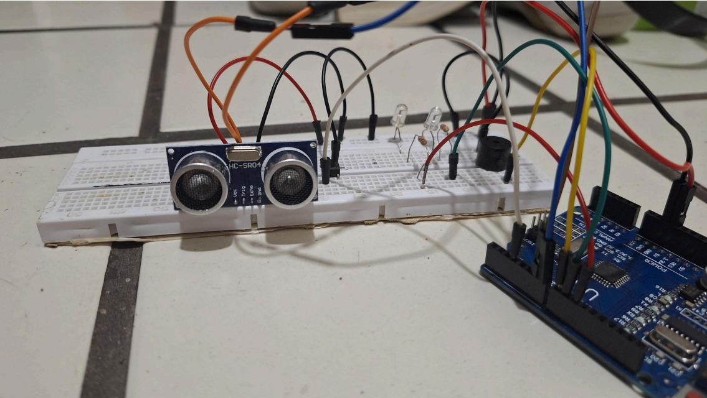

# ArduinoProject-HomeSecurity
Projeto de conclusão de Disciplina "Técnicas de programação" da UFCG  

# 🔔 Sistema de Alarme com Sensor de Movimento e Alerta de Intrusão

Este projeto consiste no desenvolvimento de um sistema de alarme utilizando um **sensor de movimento ultrassônico (HC-SR04)** integrado a um **Arduino UNO**. O sistema é capaz de detectar a presença de intrusos e emitir **alertas sonoros e visuais**, além de possibilitar a **ativação/desativação manual** via botão.


## 🧠 Visão Geral

O sistema foi projetado para ser uma solução simples, eficaz e expansível para **segurança residencial e comercial**, podendo futuramente ser integrado com notificações remotas ou automação via internet.

### Funcionalidades

- Detecção de movimento com sensor ultrassônico
- Alerta sonoro com buzzer piezoelétrico
- Alerta visual com LEDs (verde/vermelho)
- Controle manual de ativação/desativação por push-button
- Estrutura simples e de baixo custo
- Possibilidade de expansão com novos recursos (ex: Wi-Fi)

---

## ⚙️ Componentes Utilizados

- Arduino UNO  
- Sensor Ultrassônico **HC-SR04**  
- **Buzzer piezoelétrico**  
- **LED verde** (indicador de sistema ativo)  
- **LED vermelho** (indicador de intrusão)  
- **Resistores** de 220Ω  
- **Botão Push-Button**  
- **Jumpers e Protoboard**

---

## 🧰 Funcionamento

1. **Modo Ativado**
   - LED verde aceso
   - Sensor verifica movimentos na área
   - Caso detecte movimento: LED vermelho acende + buzzer toca por 5 segundos

2. **Modo Desativado**
   - Todos os LEDs permanecem apagados
   - Sensor não realiza detecção

O botão alterna entre os modos "ativado" e "desativado".

---

## 🔌 Esquemático do Circuito

- **HC-SR04**  
  - VCC → 5V  
  - GND → GND  
  - Trigger → Pino digital 7  
  - Echo → Pino digital 6  

- **Buzzer**  
  - Positivo → Pino digital 8  
  - Negativo → GND  

- **LEDs**  
  - LED Verde → Pino 9 (com resistor)  
  - LED Vermelho → Pino 10 (com resistor)  
  - Ambos os catodos → GND  

- **Botão Push-Button**  
  - Um terminal → Pino digital 3  
  - Outro terminal → GND  

---

## 📦 Instalação e Uso

1. Conecte os componentes conforme o esquema acima.
2. Faça o upload do código para o Arduino UNO.
3. Pressione o botão para ativar o sistema.
4. Teste o sensor passando na frente do campo de visão.

---

## 💻 Código

Parte do código em C++ (estrutura de classe):

```cpp
class SensorMovimento {
private:
    int triggerPin;
    int echoPin;
    long duracao;
    int distancia;
    int limiteInvasao;

public:
    SensorMovimento(int trigger, int echo, int limite = 100)
        : triggerPin(trigger), echoPin(echo), limiteInvasao(limite) {
        pinMode(triggerPin, OUTPUT);
        pinMode(echoPin, INPUT);
    }

    long medirDistancia() {
        digitalWrite(triggerPin, LOW);
        delayMicroseconds(2);
        digitalWrite(triggerPin, HIGH);
        delayMicroseconds(10);
        digitalWrite(triggerPin, LOW);
        duracao = pulseIn(echoPin, HIGH);
        distancia = duracao * 0.034 / 2;
        return distancia;
    }

    bool detectarInvasao() {
        return medirDistancia() < limiteInvasao;
    }
};
```
## ✅ Conclusão

O projeto demonstrou ser uma solução funcional e de baixo custo para segurança, com boa aplicabilidade e possibilidade de expansões. A simplicidade na montagem e a clareza na lógica de funcionamento tornam este sistema ideal para quem deseja iniciar projetos de automação ou segurança com Arduino.
